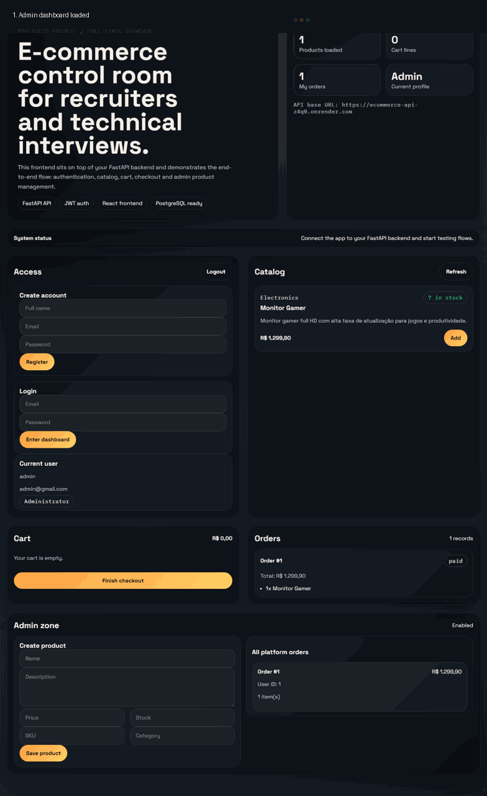

# 🛒 E-commerce Full-Stack API




**Full-stack e-commerce system built with Python, FastAPI, PostgreSQL, and React.**
Includes authentication, product management, cart, checkout flow, stock control, automated tests, and CI/CD.

---

## 🌐 Live Demo

* 🔗 Frontend: [https://e-commerce-api-beta-eight.vercel.app](https://e-commerce-api-beta-eight.vercel.app)
* 🔗 Backend API: [https://ecommerce-api-z4q0.onrender.com](https://ecommerce-api-z4q0.onrender.com)
* 📄 Swagger Docs: [https://ecommerce-api-z4q0.onrender.com/docs](https://ecommerce-api-z4q0.onrender.com/docs)

---

## ⚡ Highlights

* 🔐 JWT Authentication (register, login, current user)
* 🛍️ Product catalog with admin management
* 🛒 Shopping cart per user
* 💳 Checkout flow with stock validation
* 📦 Order history (user + admin views)
* ⚙️ Full-stack integration (React + FastAPI)
* 🧪 Automated tests with `pytest`
* 🚀 CI pipeline with GitHub Actions
* 🐳 Dockerized for local and production environments
* 🌎 Multi-language support (Portuguese, English, Spanish)

---

## 🧠 What I Built & Learned

* Designed a REST API using **FastAPI + SQLAlchemy**
* Implemented **JWT authentication and role-based access**
* Built a complete **e-commerce flow (cart → checkout → orders)**
* Integrated frontend with backend using **React + Vite**
* Set up **Docker + CI/CD pipeline**
* Structured a scalable project using clean architecture principles

---

## 🏗️ Tech Stack

**Backend**

* Python
* FastAPI
* SQLAlchemy
* Pydantic
* Passlib / JWT

**Frontend**

* React
* Vite

**Database**

* PostgreSQL

**Testing & DevOps**

* Pytest
* HTTPX
* Docker / Docker Compose
* GitHub Actions
* Render (backend)
* Vercel (frontend)

---

## 📁 Project Structure

```bash
app/
  api/
  core/
  models/
  schemas/
frontend/
tests/
assets/demo/
scripts/demo/
```

---

## 🔌 API Overview

### Auth

* `POST /api/v1/auth/register`
* `POST /api/v1/auth/login`
* `GET /api/v1/auth/me`

### Products

* `GET /api/v1/products`
* `GET /api/v1/products/{id}`
* `POST /api/v1/products` (admin)
* `PUT /api/v1/products/{id}` (admin)
* `DELETE /api/v1/products/{id}` (admin)

### Cart

* `GET /api/v1/cart`
* `POST /api/v1/cart/items`
* `PUT /api/v1/cart/items/{product_id}`
* `DELETE /api/v1/cart/items/{product_id}`

### Orders

* `POST /api/v1/orders/checkout`
* `GET /api/v1/orders/mine`
* `GET /api/v1/orders/{id}`
* `GET /api/v1/orders` (admin)

---

## 📌 Business Rules

* Initial admin bootstrap strategy for development/demo purposes
* Only admins can manage products
* Products require a unique **SKU**
* Checkout fails if stock is insufficient
* Successful checkout:

  * creates an order
  * reduces product stock

---

## 🧪 Running Locally

### Backend

```bash
pip install -r requirements.txt
cp .env.example .env
docker compose up --build
```

Open:

* [http://localhost:8000](http://localhost:8000)
* [http://localhost:8000/docs](http://localhost:8000/docs)

---

### Frontend

```bash
cd frontend
cp .env.example .env
npm install
npm run dev
```

Open:

* [http://localhost:5173](http://localhost:5173)

---

## ✅ Testing

```bash
pytest
```

Coverage includes:

* auth flow
* checkout logic
* stock validation

---

## 🚀 Deployment

### Backend (Render)

* Uses `render.yaml` blueprint
* Includes PostgreSQL provisioning

### Frontend (Vercel)

```env
VITE_API_BASE_URL=https://your-backend.onrender.com
```

---

## ⚙️ Environment Variables

Backend example:

```env
SECRET_KEY=your-secret
DATABASE_URL=postgresql://...
BACKEND_CORS_ORIGINS=["*"]
```

Frontend:

```env
VITE_API_BASE_URL=http://localhost:8000
```

---

## 🎯 Demo Flow

1. Register first user (admin)
2. Create products
3. Register a normal user
4. Add items to cart
5. Checkout
6. View orders

---

## 🔮 Future Improvements

* Pagination & filtering
* Product images
* Alembic migrations
* Payment integration
* Admin analytics dashboard
* More test coverage

---

## License

This project is licensed under the [MIT License](LICENSE).

---

## 👨‍💻 Author

Developed by **@faellim**

---
