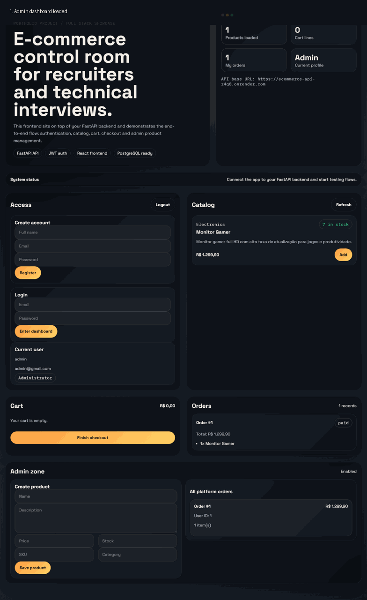

# 🛒 E-commerce Full-Stack API




**Full-stack e-commerce system built with Python, FastAPI, PostgreSQL, and React.**

Includes authentication, product management, shopping cart, checkout flow, stock control, order history, automated tests, CI/CD, and Docker support.

🚀 **Live production deployment:** Frontend and backend deployed on Render with PostgreSQL.

---

## 🌐 Live Demo

* 🔗 **Frontend:** https://ecommerce-frontend-b0mj.onrender.com
* 🔗 **Backend API:** https://ecommerce-api-z4q0.onrender.com
* 📄 **Swagger Docs:** https://ecommerce-api-z4q0.onrender.com/docs

---

## ⚡ Highlights

* 🔐 JWT Authentication (register, login, current user)
* 🛍️ Product catalog with admin management
* 🛒 Shopping cart per user
* 💳 Checkout flow with stock validation
* 📦 Order history (user + admin views)
* ⚙️ Full-stack integration (React + FastAPI)
* 🧪 Automated tests with `pytest`
* 🚀 CI pipeline with GitHub Actions
* 🐳 Dockerized for local and production environments
* 🌎 Multi-language support (Portuguese, English, Spanish)

---

## 🧠 What I Built & Learned

* Designed a REST API using **FastAPI + SQLAlchemy**
* Implemented **JWT authentication and role-based access**
* Built a complete **e-commerce flow (cart → checkout → orders)**
* Integrated frontend with backend using **React + Vite**
* Configured **Docker + Docker Compose**
* Set up **CI/CD with GitHub Actions**
* Deployed the application using **Render**
* Structured the project using clean architecture principles

---

## 🏗️ Tech Stack

### Backend

* Python 3.11
* FastAPI
* SQLAlchemy
* Pydantic
* Passlib / JWT

### Frontend

* React
* Vite

### Database

* PostgreSQL

### Testing & DevOps

* Pytest
* HTTPX
* Docker / Docker Compose
* GitHub Actions
* Render (frontend + backend + PostgreSQL)

---

## 📁 Project Structure

```bash
app/
  api/
  core/
  models/
  schemas/
frontend/
tests/
assets/demo/
scripts/demo/
🔌 API Overview
Auth
POST /api/v1/auth/register
POST /api/v1/auth/login
GET /api/v1/auth/me
Products
GET /api/v1/products
GET /api/v1/products/{id}
POST /api/v1/products (admin)
PUT /api/v1/products/{id} (admin)
DELETE /api/v1/products/{id} (admin)
Cart
GET /api/v1/cart
POST /api/v1/cart/items
PUT /api/v1/cart/items/{product_id}
DELETE /api/v1/cart/items/{product_id}
Orders
POST /api/v1/orders/checkout
GET /api/v1/orders/mine
GET /api/v1/orders/{id}
GET /api/v1/orders (admin)
📌 Business Rules
Initial admin bootstrap strategy for development/demo purposes
Only admins can manage products
Products require a unique SKU
Checkout fails if stock is insufficient
Successful checkout:
creates an order
reduces product stock
🐳 Running with Docker

The project is fully containerized and can be started locally using Docker Compose.

docker compose up --build

After the containers start, open:

Frontend: http://localhost:5173
Backend: http://localhost:8000
Swagger: http://localhost:8000/docs

The Docker Compose setup includes:

FastAPI backend
PostgreSQL database
React/Vite frontend
💻 Running Locally Without Docker
Backend
pip install -r requirements.txt
cp .env.example .env
uvicorn app.main:app --reload

Open:

http://localhost:8000
http://localhost:8000/docs
Frontend
cd frontend
cp .env.example .env
npm install
npm run dev

Open:

http://localhost:5173
✅ Testing

Run the automated test suite with:

pytest

Coverage includes:

authentication flow
checkout logic
stock validation
🚀 Deployment
Backend — Render
FastAPI deployed using Docker
PostgreSQL hosted on Render
Environment variables configured through Render
Production API:
https://ecommerce-api-z4q0.onrender.com
Frontend — Render
React + Vite deployed using Docker
Production frontend communicates with the FastAPI backend
Production API configured through:
VITE_API_BASE_URL=https://ecommerce-api-z4q0.onrender.com
Production URLs
Frontend: https://ecommerce-frontend-b0mj.onrender.com
Backend: https://ecommerce-api-z4q0.onrender.com
Swagger: https://ecommerce-api-z4q0.onrender.com/docs
⚙️ Environment Variables
Backend

Example:

SECRET_KEY=your-secret
DATABASE_URL=postgresql://...
BACKEND_CORS_ORIGINS=["*"]
Frontend

Local development example:

VITE_API_BASE_URL=http://localhost:8000

Production:

VITE_API_BASE_URL=https://ecommerce-api-z4q0.onrender.com

Production secrets and database credentials are configured through Render environment variables and are not committed to the repository.

🎯 Demo Flow
Register the first user (admin)
Log in
Create products through the admin area
Register or use a normal user
Add products to the shopping cart
Complete checkout
View order history
Administrators can view platform orders and manage products
🔮 Future Improvements
Pagination & filtering
Product images
Alembic migrations
Payment integration
Admin analytics dashboard
More test coverage
📌 Production Verification

The deployed application was tested end-to-end in the production environment.

Verified functionality includes:

Frontend loading successfully on Render
Frontend-to-backend communication
PostgreSQL persistence
User authentication
Administrator access
Product creation and catalog display
Stock control
Shopping cart
Checkout
Order creation and order history
Administrative order listing
License

This project is licensed under the MIT License.

👨‍💻 Author

Developed by @faellim
